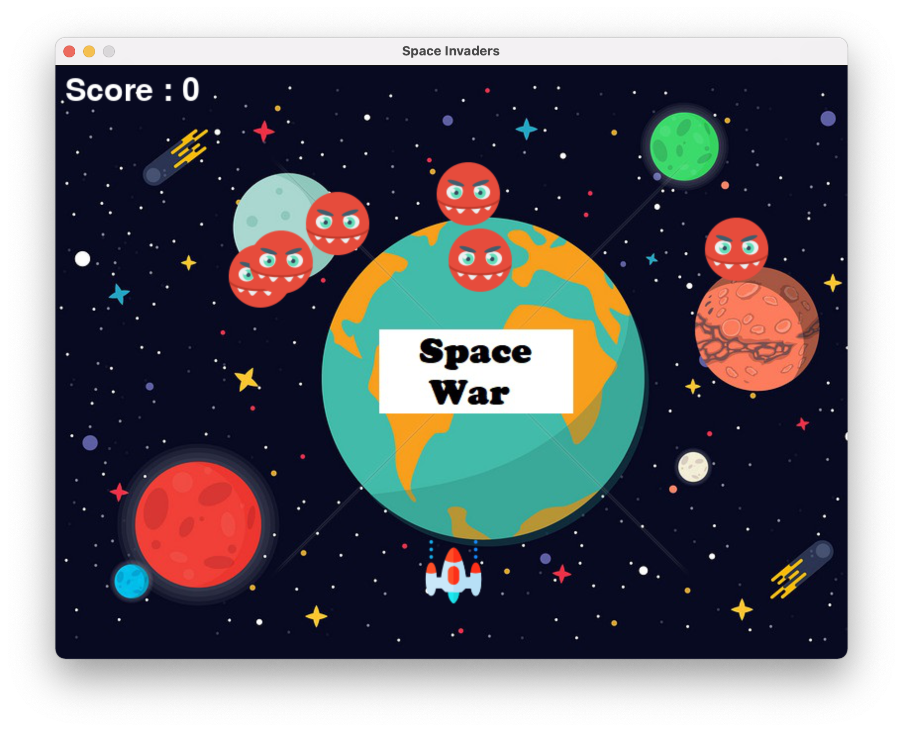

# Space Invaders

This is a simple SPACE INVADER game create using PYGAME whihc have sound and lot's of keyboard functions.

# Library Used

[PyGame](https://www.pygame.org/news), Make sure you already installed **Python 3.8** or above versions. Now run the following commands in your Terminal for installing libraries.

```bash
pip3 install pygame
```

# License

Any comments, suggestions or corrections are welcome. Contribution are welcome as This repository is licensed under [MIT](https://opensource.org/licenses/MIT) License.

